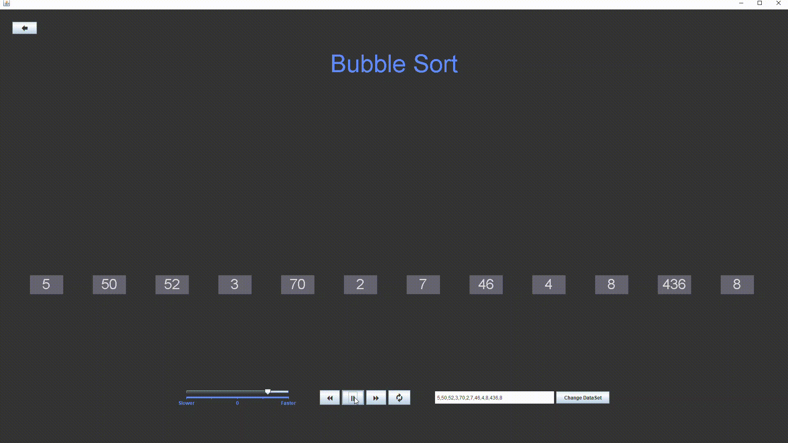
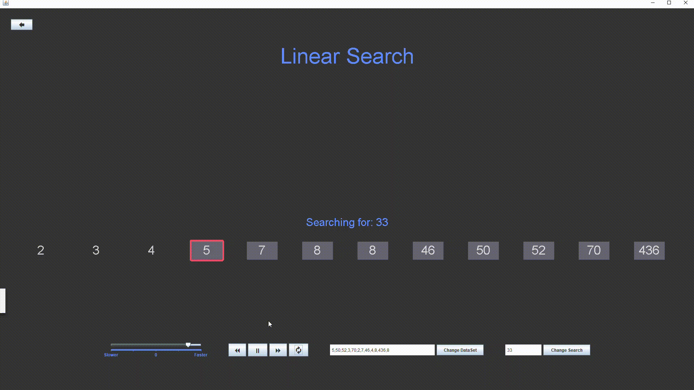
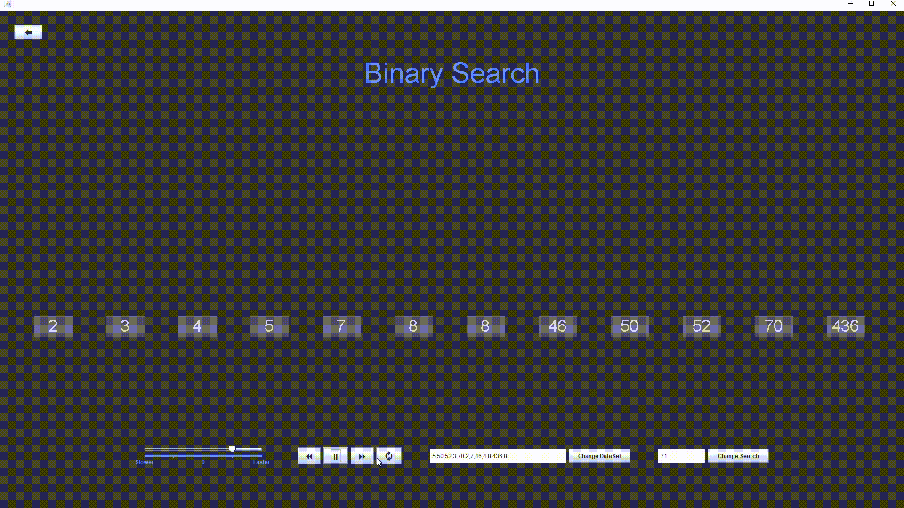

<tite>Animation of Algorithms for Effective Teaching and Learning</title>

# Table Of Contents
   - [Description](#description)
   - [Why use our app](#Whyuseourapp)
   - [Algorithms](#Algorithms)
      * [Bubble Sort](#BubbleSort)
      * [Insertion Sort](#InsertionSort)
      * [Selection Sort](#SelectionSort)
      * [Binary Search](#BinarySearch)
   - [Installation](#Installation)
   - [How to use](#Howtouse)
   - [Contributions](#Contributions)
   - [Citations](#Citations)

# <a name="description"/>Description 
  A Java based desktop application which animates many of the fundamental sorting and searching algorithms used in Computer Science. Through our application, users will gain a better understanding of how these algorithms truly function.

# <a name="Whyuseourapp"/>Why Use Our Application
  Our application have some unique options such as
 
    * Media Controls
      - Pause/Play
      - Forward/Backward 
      - Restart
    * Speed Control
    * Custom Datasets
    * Text Color Customization
    
    
# <a name="Algorithms"/>Algorithms
## <a name="BubbleSort"/>Bubble Sort  
  Bubble sort, sometimes referred to as sinking sort, is a simple sorting algorithm that repeatedly steps through the list to be sorted, compares each pair of adjacent items and swaps them if they are in the wrong order. The pass through the list is repeated until no swaps are needed, which indicates that the list is sorted. The algorithm, which is a comparison sort, is named for the way smaller or larger elements "bubble" to the top of the list. Although the algorithm is simple, it is too slow and impractical for most problems even when compared to insertion sort. Bubble sort can be practical if the input is in mostly sorted order with some out-of-order elements nearly in position. [[1]](#Citation1)

   
## <a name="InsertionSort"/>Insertion Sort
  Insertion sort is a simple sorting algorithm that builds the final sorted array (or list) one item at a time. It is much less efficient on large lists than more advanced algorithms such as quicksort, heapsort, or merge sort. Insertion sort iterates, consuming one input element each repetition, and growing a sorted output list. At each iteration, insertion sort removes one element from the input data, finds the location it belongs within the sorted list, and inserts it there. It repeats until no input elements remain. [[2]](#Citation2)
  

## <a name="SelectionSort"/>Selection Sort
  Selection sort is an algorithm that takes divides the input list into two parts: a sorted sublist of items which is built up from left to right at the front (left) of the list and a sublist of the remaining unsorted items that occupy the rest of the list. Initially, the sorted sublist is empty and the unsorted sublist is the entire input list. The algorithm proceeds by finding the smallest (or largest, depending on sorting order) element in the unsorted sublist, exchanging (swapping) it with the leftmost unsorted element (putting it in sorted order), and moving the sublist boundaries one element to the right. [[3]](#Citation3)
  

## <a name="LinearSearch"/>Linear Search
  In computer science, a linear search or sequential search is a method for finding an element within a list. It sequentially checks each element of the list until a match is found or the whole list has been searched. [[4]](#Citation4)
  

## <a name="BinarySearch"/>Binary Search
  Is a search algorithm that finds the position of a target value within a sorted array. Binary search compares the target value to the middle element of the array. If they are not equal, the half in which the target cannot lie is eliminated and the search continues on the remaining half, again taking the middle element to compare to the target value, and repeating this until the target value is found. If the search ends with the remaining half being empty, the target is not in the array. [[5]](#Citation4)
  

# <a name="Installation"/>Installation
   Steps to install the app:
   1.  Download and install the latest version of the Java Runtime Environment for your computer
       - https://www.oracle.com/java/technologies/javase-jre8-downloads.html
   3.  Download and run JAR file

# <a name="Howtouse"/>How To Use
## Home Page
   Here you will find a textbox filled with preset data to use or the user can manually enter a data set. Then the user can choose an Algorithm that they would like to learn. The user can enter the settings page from the home screen as well. 
   
## Settings
   On this page the user can customize the look and feel of the application. Also this is where users can use our "Submit Feedback" form to let us know how we can improve!
   
## Within Each Algorithm
   The user will be able to visually learn the selected algorithm. The user will also be able to speed up or slow down the animation to aid them in understanding the algorithm. There is a pause/play button which allow the user to take their time learning. Additionally, the user will also be able to edit the data set by adding or deleting elements as they please, and all of this can be done right there on the learning page. Our searching algorithms will also allow the user search for a specific number in the data set.
   
   
# <a name="Contributions"/>Contribution
This application was created by four hard-working students at the University at Albany:

   * Ahmad 
   * David
   * Kyler
   * Noah

# <a name="Citations"/>Citations
1. <a name="Citation1"/>Bubble sort. (2021). Wikipedia. https://en.wikipedia.org/wiki/Bubble_sort
2. <a name="Citation2"/>Insertion sort. (2021). Wikipedia. https://en.wikipedia.org/wiki/Insertion_sort
3. <a name="Citation3"/>Selection sort. (2021). Wikipedia. https://en.wikipedia.org/wiki/Selection_sort
4. <a name="Citation4"/>Linear search. (2021). Wikipedia. https://en.wikipedia.org/wiki/Binary_search_algorithm
5. <a name="Citation5"/>Binary search algorithm. (2021). Wikipedia. https://en.wikipedia.org/wiki/Binary_search_algorithm
6. Linear Search. (2021). GeeksforGeeks. https://www.geeksforgeeks.org/linear-search/
7. Binary Search. (2021). GeeksforGeeks. https://www.geeksforgeeks.org/binary-search/
8. Bubble Sort. (2021). GeeksforGeeks. https://www.geeksforgeeks.org/bubble-sort/
9. Insertion Sort. (2021). GeeksforGeeks. https://www.geeksforgeeks.org/insertion-sort/
10. Selection Sort. (2021). GeeksforGeeks. https://www.geeksforgeeks.org/selection-sort/

